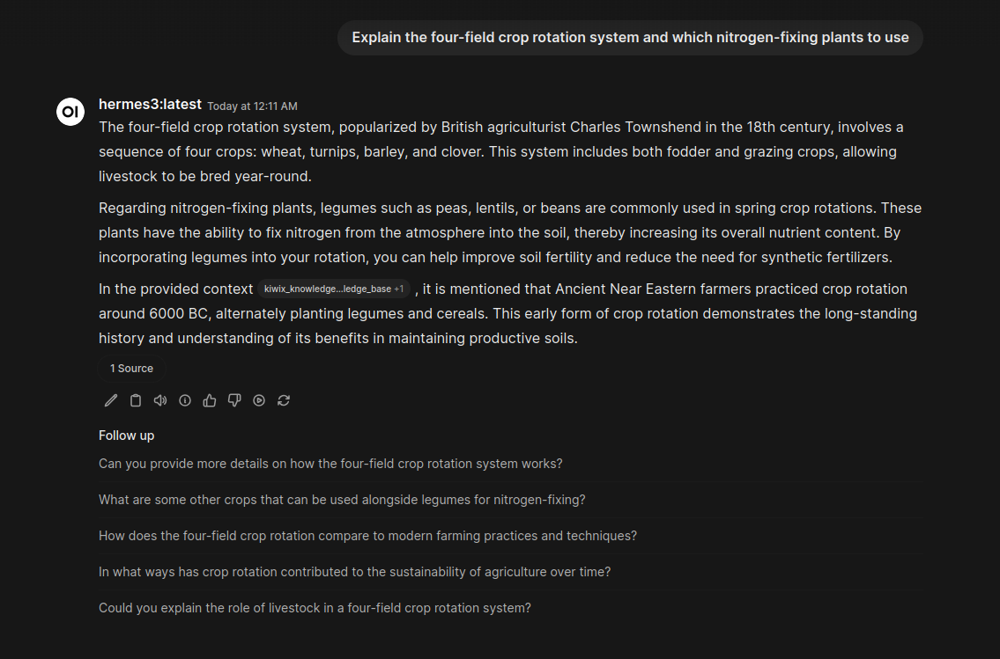

# Civilization Node

**Offline Knowledge Retrieval & LLM Interface**



`civilization_node` is a self-hosted, offline-first application that integrates a local LLM inference engine with large-scale static knowledge bases (Wikipedia, StackOverflow, iFixit).

It leverages **Retrieval Augmented Generation (RAG)** to ground LLM responses in verifiable data stored in local ZIM archives, enabling high-fidelity technical assistance without an internet connection.

Designed for air-gapped environments, digital preservation, and off-grid reliability.

## Architecture

The system is composed of three primary components:

*   **Inference Engine**: [Ollama](https://ollama.com) running `dolphin-llama3` (customized via `Modelfile`) for query processing and reasoning.
*   **Knowledge Base**: [Kiwix](https://kiwix.org) tools reading compressed ZIM archives (e.g., `wikipedia_en_all_nopic.zim`).
*   **Interface**: [Open WebUI](https://docs.openwebui.com) serving as the frontend and orchestration layer.

## System Requirements

| Component | Specification |
|-----------|---------------|
| **OS**    | Linux (Ubuntu 22.04+ recommended) or WSL2 (Windows) |
| **RAM**   | 12GB Minimum (16GB+ Recommended to prevent OOM kills) |
| **Storage** | 100GB+ (Dependent on selected ZIM archives) |
| **GPU**   | Optional. CPU inference works but is slower. |

## Installation

### 1. Dependencies
Ensure `docker` and `docker compose` are installed.

```bash
# Verify installation
docker compose version
```

### 2. LLM Backend Setup (Ollama)
Install Ollama and configure it to bind to `0.0.0.0` so the Docker container can access it.

```bash
# Install
curl -fsSL https://ollama.com/install.sh | sh

# Configure systemd override for network binding
sudo mkdir -p /etc/systemd/system/ollama.service.d
echo '[Service]
Environment="OLLAMA_HOST=0.0.0.0"' | sudo tee /etc/systemd/system/ollama.service.d/override.conf

# Reload and restart
sudo systemctl daemon-reload
sudo systemctl restart ollama
```

### 3. Model Provisioning
Pull the base model and create the custom system-prompt configuration.

```bash
# Pull base model
ollama pull dolphin-llama3

# Build the custom "Librarian" model
ollama create survival-librarian -f Modelfile.survival

# Pull embedding model for RAG (optional usage)
ollama pull nomic-embed-text
```

### 4. Application Deployment
Clone the repository and initialize the environment.

```bash
# Initialize directories and environment variables
cp .env.example .env
./setup_env.sh

# Start the application stack
docker compose up -d
```

## Data Management

The system relies on ZIM archives. Use the included utility script to download them ensuring they are placed in the correct volume path.

```bash
./maintenance/list_available_content.sh
```

**Recommended Archives:**
*   `wikipedia_en_all_nopic`: General encyclopedia.
*   `ifixit_en_all`: Repair manuals.
*   `stackoverflow.com_en_all`: Technical Q&A.

## Configuration

### Activating the Kiwix Tool
The LLM requires the Python tool definition to query the ZIM files.

1.  Navigate to `http://localhost:3000`.
2.  Go to **Workspace > Tools > Create Tool**.
3.  Copy the content of `kiwix_tool.py` into the editor.
4.  Save as "Kiwix".
5.  **Enable the tool** in your Chat Settings when starting a new session.

## Troubleshooting

**Connection Refused**:
Ensure Ollama is running and listening on all interfaces. Check status:
```bash
systemctl status ollama
netstat -tulpn | grep 11434
```

**ZIM Read Errors**:
Corrupt downloads can crash the reader. Verify checksums or delete the latest file in `/opt/civilization/library/zims`.

